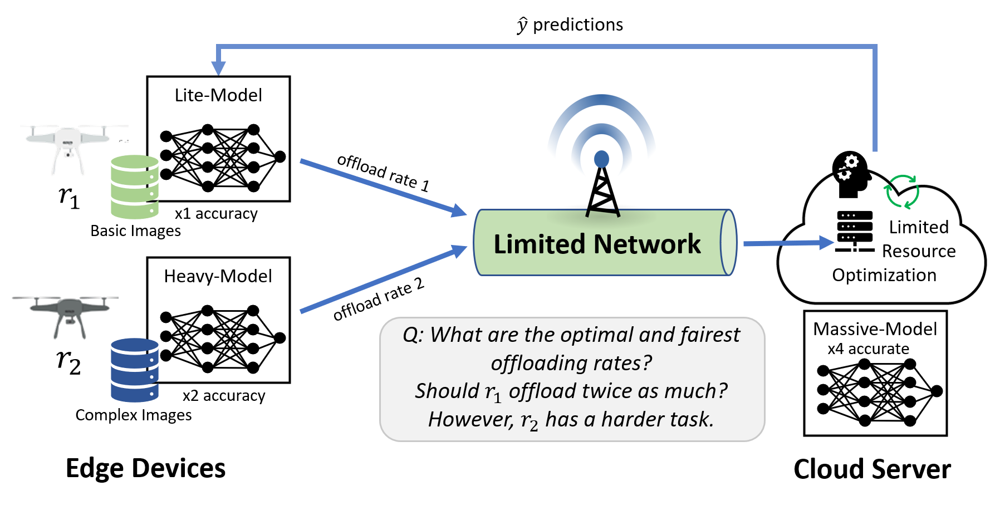

# A Fair Resource Allocation Framework for Distributed Machine Learning

Welcome to the FairSynergy repository! FairSynergy is an innovative algorithmic framework designed to optimize resource allocation and establish fair pricing mechanisms for multi-agent machine learning (ML) systems operating in distributed edge environments. This repository contains the implementation of FairSynergy along with resources to help you understand and apply this framework in various distributed ML scenarios.

## Table of Contents

- [About](#about)
- [Usage](#usage)
- [Project Structure](#project-structure)
    - [Files and Directories](#files-and-directories)
- [License](#license)

## About
What is FairSynergy?
FairSynergy addresses the challenge of equitable allocation of cloud resources among diverse edge devices, ranging from mobile phones to IoT devices, collaborating with resource-intensive cloud-based ML models. The key problem is demonstrated in the [figure](./experimental_data/figures/toyex.PNG) below. The framework leverages the concave relationship between ML model accuracy and system resources, integrating this insight into the well-established Network Utility Maximization (NUM) framework. By doing so, FairSynergy offers an optimal resource allocation strategy, accommodating the complexities of both distributed learning and real-time inference scenarios.



## Usage

#### Packages
For the installation of the required packages run the following command to install the required packages in [environment.yml](environment.yml).
```bash
conda env create -f environment.yml
conda activate fairsynergy
```

To see the experimental results in the ipynb files or to regenerate them, please see [Files and Directories](#files-and-directories) to know which file to check.

## Project Structure

```plaintext
|____EEN_boxplot_exp.ipynb
|____table_experiments.ipynb
|____optimization.py
|____experimental_data
| |____DL_BoxPlot_Results.npy
| |____DL_configs.json
| |____DL_Feasibility_Results_R100.npy
| |____EEN_Feasibility_Results_R100.npy
| |____DL_microscaleexp.ipynb
| |____DL_boxplot_exp.ipynb
| |____DL_feasibility_experiments.ipynb
| |____EEN_feasibility_experiments.ipynb
| |____EEN_microscaleexp.ipynb
|____environment.yml
|____simulations.py
```

### Files and Directories


EEN_boxplot_exp.ipynb: This Jupyter Notebook file contains experiments related to Efficient Evolutionary Neural Networks (EEN) boxplots.

table_experiments.ipynb: This Jupyter Notebook file contains experiments related to tables or tabular data.

optimization.py: This Python script file is used for optimization tasks within the project.

experimental_data: This directory contains experimental data files and notebooks.

DL_BoxPlot_Results.npy: NumPy array file containing results of Deep Learning (DL) box plots.

DL_configs.json: JSON file storing configurations/settings related to Deep Learning experiments.

DL_Feasibility_Results_R100.npy: NumPy array file containing feasibility results of DL experiments.

EEN_Feasibility_Results_R100.npy: NumPy array file containing feasibility results of EEN experiments.

DL_microscaleexp.ipynb: Jupyter Notebook file for microscale experiments in Deep Learning.

DL_boxplot_exp.ipynb: Jupyter Notebook file containing Deep Learning boxplot experiments.

DL_feasibility_experiments.ipynb: Jupyter Notebook file containing feasibility experiments related to Deep Learning.

EEN_feasibility_experiments.ipynb: Jupyter Notebook file containing feasibility experiments related to EEN.

EEN_microscaleexp.ipynb: Jupyter Notebook file for microscale experiments in EEN.

environment.yml: This YAML file defines the project's environment specifications, often used with Anaconda or Conda to recreate the environment.

simulations.py: This Python script file contains code related to simulations.

fs_plot_utils.py: This Python script file contains utility functions for plotting within the project.


